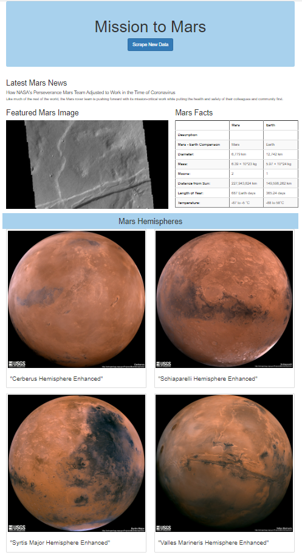

# Mission-to-Mars Web Scraping Project

## Objective
We will create an automated scraping process to extract Mars exploration information from multiple websites and then display them with our web application.

## Details
We will use Chrome Developer Tools to identify HTML components from our target websites. Then using BeautifulSoup and Splinter, we will automate our scraping process to extract data we are interested in. We will then store this data in MongoDB. Finally, we will create a web application using Flask to display information we collected.

## Programming Scripts:
* We will first test our scraping code in [Mission_to_Mars_Challenge.ipynb](Mission_to_Mars_Challenge.ipynb) 

* We then create our scraping python file based on the tested code in [scraping.py](apps/app.py)

* Our Flask script is in [app.py](apps/app.py)

* Finally we will display our information on a web application in [index.html](apps/templates/index.html) 

## Web App Display 

